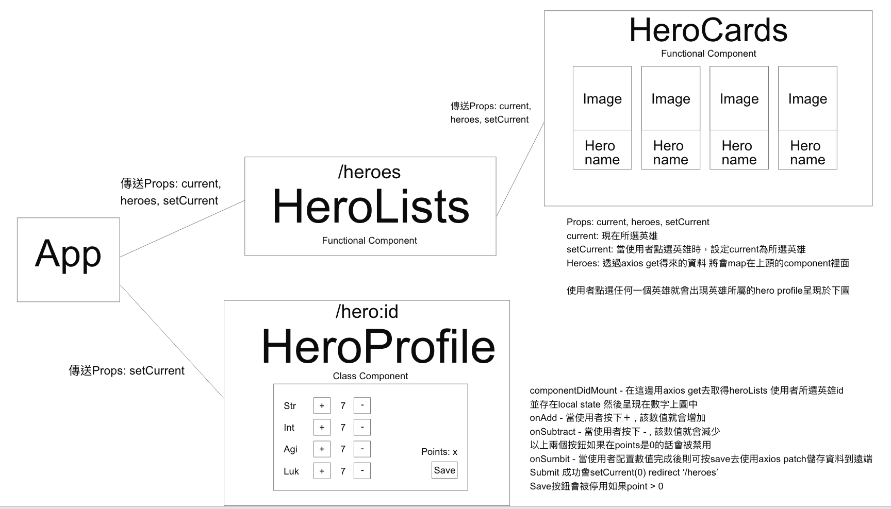

# Hahow Frontend Engineer 徵才小專案 - Karen Hou

## Installing

```
git clone https://github.com/karenhou/hahow-hero-app.git
cd hahow-hero-app
npm install
```

## Compile

```
npm start
```

## Framework Used

- [React](https://reactjs.org/) - A JavaScript library for building user interfaces
- [Boostrap](https://getbootstrap.com/) - CSS framework library

## 3rd Party Tools Used

- [Axios](https://github.com/axios/axios) - Promise based HTTP client for the browser and node.js
- [alertifyjs](https://alertifyjs.com/) - For alerts/dialog
- [styled-components](https://www.styled-components.com/) - managing your styles as components
- [react-particles-js](https://www.npmjs.com/package/react-particles-js) - for particle animated background effects
- [react-bootstrap](https://react-bootstrap.github.io/) - allow you to use bootstrap components as components
- [react-animations](https://www.npmjs.com/package/react-animations) - a collection of animation
- [font awesome](https://fontawesome.com/) - free icons

---

### Details

1. 依照 github 需求使用 react+bootstrap 以及其他的第三方工具去完成
2. 註解原則

   - 個別 function 的大概功能
   - local state 的使用的理由
   - code 裡我覺得不太直覺的部分

3. 專案架構
   

4. 困難遇到
   1. 在/heroes/:heroid 頁面 refresh，無法得知現在所選英雄因為 heroes 沒有在 route 裡面
      - 辦法: 在 componentDidMount 底下去取得現在網頁的位置，得知現在的 hero id 轉而去設定 current 然後以 props 的方式傳至 heroCards component
